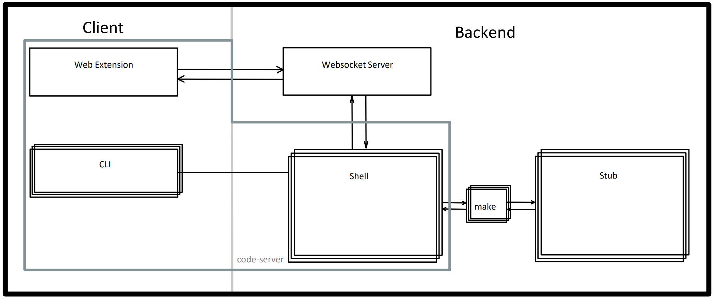

[RIOT-OS]: https://github.com/RIOT-OS/RIOT
[RIOT-WebEditor]: https://github.com/cheater78/RIOT-WebEditor
[coder/code-server]: https://github.com/coder/code-server
[RIOT-VS-Code-Extension]: https://github.com/Barkolores/RIOT-VS-Code-Extension
[traefik]: https://github.com/traefik/traefik
[rnode-flasher]: https://github.com/liamcottle/rnode-flasher
[esptool-js]: https://github.com/espressif/esptool-js

# [RIOT-OS][RIOT-OS] Web Editor
Project for the RIOT-OS Web Editor, uses:
- [coder/code-server][coder/code-server] as VSCode style Editor (MS Monaco)
- [RIOT-VS-Code-Extension][RIOT-VS-Code-Extension]

## Install / Deploy
### Prerequisites
- docker
- [RIOT-VS-Code-Extension][RIOT-VS-Code-Extension] submodule, by either:
    -  ``` --recurse ``` during clone
    - or afterwards ``` git submodule update --init ```

### Steps
as root, run:
1. ``` chmod +x ./setup.sh && ./setup.sh ```
2. ``` ./docker.sh -b -s ```


## Config [code-server][coder/code-server]
The code-server config file is located at [config/code-server.conf.yaml](config/code-server.conf.yaml)
### set password hash (argon2)
```
# Requires argon2
sudo apt install argon2
# Change to your password
echo -n "changeme" | argon2 "$(head -c16 /dev/urandom | base64)"
# Then use the Encoded string
```
The current password set in [code-server.conf.yaml](config/code-server.conf.yaml) is **changeme** for demonstration purposes only.
Leave unset for no password.
## Config VSCode
The default vscode user settings file is located at [config/default-vscode-user-settings.json](config/default-vscode-user-settings.json)

Current features:
- RIOT convention: line ruler
- DarkMode for your eye balls
- Riot-Web-Shell for interactive Web UX

## docker.sh helper script
builds and runs the [RIOT-WebEditor][RIOT-WebEditor] docker image
- -b: build
- -s: start
- -u: update [RIOT-VS-Code-Extension][RIOT-VS-Code-Extension]
- -n: skip [RIOT-VS-Code-Extension][RIOT-VS-Code-Extension] packaging
- -d: debug/no cache


## Supported Boards (by flasher)
- esptool:
    - esp32c3-devkit
    - esp32c3-wemos-mini
    - esp32c6-devkit
    - esp32-ethernet-kit-v1_0
    - esp32-ethernet-kit-v1_1
    - esp32-ethernet-kit-v1_2
    - esp32h2-devkit
    - esp32-heltec-lora32-v2
    - esp32-mh-et-live-minikit
    - esp32-olimex-evb
    - esp32s2-devkit
    - esp32s2-lilygo-ttgo-t8
    - esp32s2-wemos-mini
    - esp32s3-box
    - esp32s3-devkit
    - esp32s3-pros3
    - esp32s3-usb-otg
    - esp32s3-wt32-sc01-plus
    - esp32-ttgo-t-beam
    - esp32-wemos-d1-r32
    - esp32-wemos-lolin-d32-pro
    - esp32-wroom-32
    - esp32-wrover-kit
    - esp8266-esp-12x
    - esp8266-olimex-mod
    - esp8266-sparkfun-thing
    - seeedstudio-xiao-esp32c3
    - seeedstudio-xiao-esp32s3
- adafruit-nrfutil:
    - adafruit-clue
    - adafruit-feather-nrf52840-express
    - adafruit-feather-nrf52840-sense
    - adafruit-itsybitsy-nrf52
    - pro-micro-nrf52840
    - seeedstudio-xiao-nrf52840-sense
    - seeedstudio-xiao-nrf52840

## Design considerations

### Frontend UI
[coder/code-server][coder/code-server] as VSCode web editor
- familiarity
- IDE like
- remote CLIs

### Architecture


### Protocol
All protocol messages and communication sequences are documented [here](./docs/RIOT-Protocol-V-0-0-2.pdf).

### Command trigger by VSCode Extension UI
- does the cli command for you, but shows it, so you can learn to do it yourself
- behaves exactly like cli after issuing the command

### Command trigger by CLI
the user could issue a make flash / term call many different ways:
```
make flash              # parsable from stdin
./flash_my_device.sh    # parsable as file

# in flash_my_dev.py
os.run("make flash")    # separatly invoked shell or process, no longer parsable

# in a worse flash_my_dev.py
pid, fd = os.fork()
if pid == 0:
    os.exec("/bin/sh")
else:
    stdin = os.dup2(fd, 0)
    os.write(stdin, b"make flash") # executed on a different process, not parsable, not hookable
```
that's why we:
- use a stub (riot-web-tools/stub) which behaves as a flasher or serial tool
- patch [RIOT-OS][RIOT-OS]' make system to call this stub with necessary arguments for supported boards
this looks something like:
```
# for make flash (hello-world on esp32-wroom-32)
/usr/bin/riot-web-tools/stub/stub
    "flash"
    "Device1"
    "esp32-wroom-32"
    "esptool"
    "{\"0x1000\":\"/home/coder/RIOT/examples/basic/hello-world/bin/esp32-wroom-32/esp_bootloader/bootloader.bin\",\"0x8000\":\"/home/coder/RIOT/examples/basic/hello-world/bin/esp32-wroom-32/partitions.bin\",\"0x10000\":\"/home/coder/RIOT/examples/basic/hello-world/bin/esp32-wroom-32/hello-world.elf.bin\"}"
    "--chip esp32 --port Device1 --baud 460800 --before default-reset write-flash -z --flash-mode dout --flash-freq 40m --flash-size detect 0x1000 /home/coder/RIOT/examples/basic/hello-world/bin/esp32-wroom-32/esp_bootloader/bootloader.bin 0x8000 /home/coder/RIOT/examples/basic/hello-world/bin/esp32-wroom-32/partitions.bin 0x10000 /home/coder/RIOT/examples/basic/hello-world/bin/esp32-wroom-32/hello-world.elf.bin"
# for make term (on esp32-wroom-32)
/usr/bin/riot-web-tools/stub/stub
    "term"
    "Device1"
    "esp32-wroom-32"
    "115200"
```
using the stub and patched RIOT make, any supported call will always result in relaying that command via websocket (requires env RIOT_WEB=1)

### Flashing from the Web
Supported APIs by browsers:
- WebSerial
- WebUSB (unused)
- WebHID (unused)

flash / serial communication through js implementation:
- [esptool-js][esptool-js] for esp32, esp8266
- [rnode-flasher][rnode-flasher] as adafruit-nrfutil for adafruit feather sense

### Websocket for requests, commands and flash payloads
- one connection between Client and Backend to reduce overhead and used ports
- a ws relay routing messages between shells and client/devices
- custom protocol:
    - avoiding remote code execution
    - locking devices and shells to running tasks
    - relaying flash logs and serial communication from device to shell

## Open issues

### Multi-user centrialized hosting
Current Architecture:
- 1x [coder/code-server][coder/code-server]
- 1x [RIOT-WebEditor][RIOT-WebEditor] docker container

comprises one developement environment (e.g. one per user)

Proposed extension:
- run multiple [RIOT-WebEditor][RIOT-WebEditor] docker containers in a docker host
- use [traefik][traefik] (or similar) as reverse proxy, for:
    - SSL termination
    - subdomain mapping to docker container (443 -> container_http, 7777 -> container_websocket)
- a custom web-frontend to create / spin-up / retire [RIOT-WebEditor][RIOT-WebEditor] containers

## General Notes
- when developing and testing the [RIOT-VS-Code-Extension][RIOT-VS-Code-Extension], dockers caching and vscodes versioning are your greatest enemy
    - increase the extension version in package.json
    - increase the RIOT_WEB_VSCODE_EXTENSION_VERSION in the Dockerfile to match that version
    - then rebuild the image
    - browser (such as brave) cache site data (such as the extension.js), even though you "clear\[ed\] cookies AND SITE DATA"
        - in order to get rid of your old STILL CACHED extension you need to clear your browser data in settings
        - deleting service workers or clearing site data using debug>Application>Storage>Clear ALSO WON'T DO ANYTHING
        - you have been warned, turn back before its too late, traveler
- docker.sh is a tool to help with dev/test/deployment, you should adjust it to your workflow
